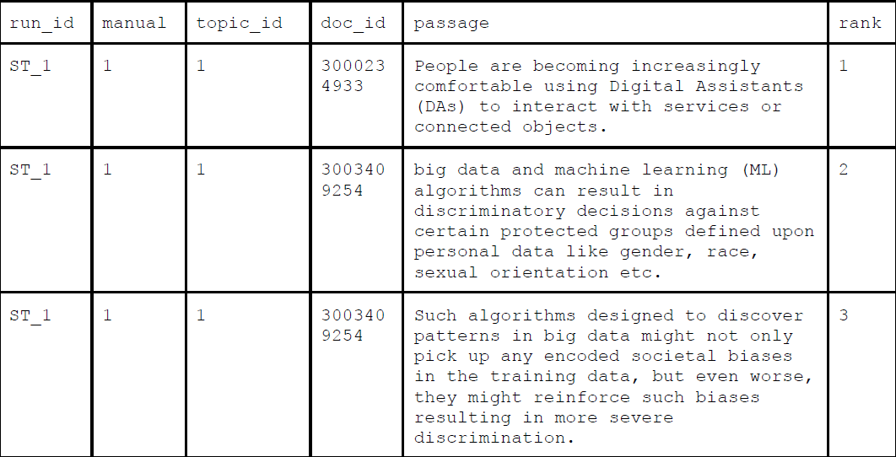

# SimpleText@CLEF-2021 Pilot tasks

[Home](https://simpletext-madics.github.io/2021/clef/en) | [Call for papers](https://simpletext-madics.github.io/2021/clef/en/CFP) | [Important dates](https://simpletext-madics.github.io/2021/clef/en/dates) | [Pilot tasks](https://simpletext-madics.github.io/2021/clef/en/tasks) | [Program](https://simpletext-madics.github.io/2021/clef/en/program) | [Organisers](https://simpletext-madics.github.io/2021/clef/en/organisers) | [Contact](https://simpletext-madics.github.io/2021/clef/en/contact) | 

---

## SimpleText Pilot Task Guidelines

We invite you to submit both automatic and manual runs! Manual intervention should be reported.

## Access
Please register at the SimpleText@CLEF workshop in order to access the data: [http://clef2021-labs-registration.dei.unipd.it/](http://clef2021-labs-registration.dei.unipd.it/)  
After registration, you will receive an email with information on how to log in to the data server: [https://guacamole.univ-avignon.fr](https://guacamole.univ-avignon.fr)

### Result submission:
Participants should put their run results into the folder Documents created for their user.

### 2021 DataSet
For this edition we use the Citation Network Dataset: DBLP+Citation, ACM Citation network ([https://www.aminer.org/citation](https://www.aminer.org/citation)). An elastic search index is provided to participants accessible through a GUI API. This Index is adequate to:
* apply basic passage retrieval methods based on vector or language IR models
* generate Latent Dirichlet Allocation models,
* train Graph Neural Networks for citation recommendation as carried out in [https://stellargraph.readthedocs.io/](https://stellargraph.readthedocs.io/) for example,
* apply deep bi directionnal transformers for query expansion.
* and much more …

### 2021 Queries
For this edition queries are a selection of recent n press titles from The Guardian enriched with keywords manually extracted from the content of the article. It has been checked that each keyword allows to extract at least 5 relevant abstracts. The use of these keywords is optional.

*Input format for all tasks:*
* Topics are in the MD format

* Full text articles from The Guardian (link, folder query_related_content with full texts in the MD format)
* ElasticSearch index on the following data server (e.g.): [https://guacamole.univ-avignon.fr/nextcloud/index.php/apps/files/?dir=/simpleText/queries&fileid=570352](https://guacamole.univ-avignon.fr/nextcloud/index.php/apps/files/?dir=/simpleText/queries&fileid=570352)
* DBLP full dump in the JSON.GZ format
* DBLP abstracts extracted for each topic in the following MD format (doc_id, year, abstract):

## Pilot Task 1: Selecting passages to include in a simplified summary - Content Simplification

Given an article from a major international newspaper general audience, this pilot task aims at retrieving from a large scientific bibliographic database with abstracts, all passages that would be relevant to illustrate this article. Extracted passages should be adequate to be inserted as plain citations in the original paper.

*Output:*  
 
A maximum of 1000 passages to be included in a simplified summary in a TSV (Tab-Separated Values) file with the following fields:
* run_id: Run ID starting with team_id_
* manual: Whether the run is manual {0,1}
* topic_id: Topic ID
* doc_id: Source document ID
* passage: Text of the selected passage
* rank: Passage rank

*run_id &nbsp;&nbsp;&nbsp;&nbsp;&nbsp;&nbsp;&nbsp;&nbsp; manual &nbsp;&nbsp;&nbsp;&nbsp;&nbsp;&nbsp;&nbsp;&nbsp; topic_id &nbsp;&nbsp;&nbsp;&nbsp;&nbsp;&nbsp;&nbsp;&nbsp; doc_id &nbsp;&nbsp;&nbsp;&nbsp;&nbsp;&nbsp;&nbsp;&nbsp; passage &nbsp;&nbsp;&nbsp;&nbsp;&nbsp;&nbsp;&nbsp;&nbsp; rank*

### Evaluation  
Sentence pooling and automatic metrics will be used to evaluate these results. The relevance of the source document will be evaluated as well as potential unresolved anaphora issues.

Example of OUTPUT:  

