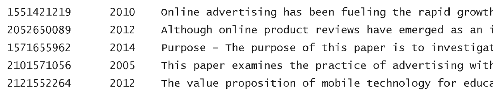

# SimpleText@CLEF-2021 Pilot tasks

[Home](https://simpletext-madics.github.io/2021/clef/en) | [Call for papers](https://simpletext-madics.github.io/2021/clef/en/CFP) | [Important dates](https://simpletext-madics.github.io/2021/clef/en/dates) | [Pilot tasks](https://simpletext-madics.github.io/2021/clef/en/tasks) | [Program](https://simpletext-madics.github.io/2021/clef/en/program) | [Publications](https://simpletext-madics.github.io/2021/clef/en/publications) | [Organisers](https://simpletext-madics.github.io/2021/clef/en/organisers) | [Contact](https://simpletext-madics.github.io/2021/clef/en/contact) | 

---

## SimpleText Pilot Task Guidelines

We invite you to submit both automatic and manual runs! Manual intervention should be reported.

## Access
Please register at the SimpleText@CLEF workshop in order to access the data: [http://clef2021-labs-registration.dei.unipd.it/](http://clef2021-labs-registration.dei.unipd.it/)  
After registration, you will receive an email with information on how to log in to the data server: [https://guacamole.univ-avignon.fr](https://guacamole.univ-avignon.fr)

### Result submission:
Participants should put their run results into the folder Documents created for their user.

### 2021 DataSet
For this edition we use the Citation Network Dataset: DBLP+Citation, ACM Citation network ([https://www.aminer.org/citation](https://www.aminer.org/citation)). An elastic search index is provided to participants accessible through a GUI API. This Index is adequate to:
* apply basic passage retrieval methods based on vector or language IR models
* generate Latent Dirichlet Allocation models,
* train Graph Neural Networks for citation recommendation as carried out in [https://stellargraph.readthedocs.io/](https://stellargraph.readthedocs.io/) for example,
* apply deep bi directionnal transformers for query expansion.
* and much more …

### 2021 Queries
For this edition queries are a selection of recent n press titles from The Guardian enriched with keywords manually extracted from the content of the article. It has been checked that each keyword allows to extract at least 5 relevant abstracts. The use of these keywords is optional.

*Input format for all tasks:*
* Topics are in the MD format

* Full text articles from The Guardian (link, folder query_related_content with full texts in the MD format)
* ElasticSearch index on the following data server (e.g.): [https://guacamole.univ-avignon.fr/nextcloud/index.php/apps/files/?dir=/simpleText/queries&fileid=570352](https://guacamole.univ-avignon.fr/nextcloud/index.php/apps/files/?dir=/simpleText/queries&fileid=570352)
* DBLP full dump in the JSON.GZ format
* DBLP abstracts extracted for each topic in the following MD format (doc_id, year, abstract):

## Pilot Task 1: Selecting passages to include in a simplified summary - Content Simplification

Given an article from a major international newspaper general audience, this pilot task aims at retrieving from a large scientific bibliographic database with abstracts, all passages that would be relevant to illustrate this article. Extracted passages should be adequate to be inserted as plain citations in the original paper.

*Output format:*  
 
A maximum of 1000 passages to be included in a simplified summary in a TSV (Tab-Separated Values) file with the following fields:
* *run_id*: Run ID starting with team_id_
* *manual*: Whether the run is manual {0,1}
* *topic_id*: Topic ID
* *doc_id*: Source document ID
* *passage*: Text of the selected passage
* *rank*: Passage rank

*run_id &nbsp;&nbsp;&nbsp;&nbsp;&nbsp;&nbsp;&nbsp;&nbsp; manual &nbsp;&nbsp;&nbsp;&nbsp;&nbsp;&nbsp;&nbsp;&nbsp; topic_id &nbsp;&nbsp;&nbsp;&nbsp;&nbsp;&nbsp;&nbsp;&nbsp; doc_id &nbsp;&nbsp;&nbsp;&nbsp;&nbsp;&nbsp;&nbsp;&nbsp; passage &nbsp;&nbsp;&nbsp;&nbsp;&nbsp;&nbsp;&nbsp;&nbsp; rank*

### Evaluation  
Sentence pooling and automatic metrics will be used to evaluate these results. The relevance of the source document will be evaluated as well as potential unresolved anaphora issues.

OUTPUT example:  
| run_id | manual | topic_id | doc_id | passage | rank |
|:-------|:-------|:---------|:-------|:--------|:-----|
| ST1_1 | 1 | 1 | 3000234933 | People are becoming increasingly comfortable using Digital Assistants (DAs) to interact with services or connected objects. | 1 |
| ST1_1 | 1 | 1 | 3003409254 | big data and machine learning (ML) algorithms can result in discriminatory decisions against certain protected groups defined upon personal data like gender, race, sexual orientation etc. | 2 |
| ST1_1 | 1 | 1 | 3003409254 | Such algorithms designed to discover patterns in big data might not only pick up any encoded societal biases in the training data, but even worse, they might reinforce such biases resulting in more severe discrimination. | 3 |

## Pilot Task 2: Identifying difficult-to-understand concepts for non experts - Content Simplification

The goal of this pilot task is to decide which terms (up to 10) require explanation and contextualization to help a reader to understand a complex scientific text - for example, with regard to a query, terms that need to be contextualized (with a definition, example and/or use-case).

*Output format:*  
List of terms to be contextualized in a tabulated file TSV with the following fields:
* *run_id*: Run ID starting with team_id_
* *manual*: Whether the run is manual {0,1}
* *topic_id*: Topic ID
* *passage_text*: Passage text
* *term*: Term or other phrase to be explained
* *rank*: Importance of the explanation for a given term

Run_id &nbsp;&nbsp;&nbsp;&nbsp;&nbsp;&nbsp;&nbsp; manual &nbsp;&nbsp;&nbsp;&nbsp;&nbsp;&nbsp;&nbsp; topic_id &nbsp;&nbsp;&nbsp;&nbsp;&nbsp;&nbsp;&nbsp; passage_text &nbsp;&nbsp;&nbsp;&nbsp;&nbsp;&nbsp;&nbsp; term &nbsp;&nbsp;&nbsp;&nbsp;&nbsp;&nbsp;&nbsp; rank

### Evaluation
Term pooling and automatic metrics (NDCG,...) will be used to evaluate these results.

OUTPUT example:

| run_id | manual | topic_id | passage_text | term | rank |
|:-------|:-------|:---------|:-------------|:-----|:-----|
| ST_1 | 1 | 1 | Automated decision making based on big data and machine learning (ML) algorithms can result in discriminatory decisions against certain protected groups defined upon personal data like gender, race, sexual orientation etc. Such algorithms designed to discover patterns in big data might not only pick up any encoded societal biases in the training data, but even worse, they might reinforce such biases resulting in more severe discrimination. The majority of thus far proposed fairness-aware machine learning approaches focus solely on the pre-, in- or post-processing steps of the machine learning process, that is, input data, learning algorithms or derived models, respectively. However, the fairness problem cannot be isolated to a single step of the ML process. Rather, discrimination is often a result of complex interactions between big data and algorithms, and therefore, a more holistic approach is required. The proposed FAE (Fairness-Aware Ensemble) framework combines fairness-related interventions at both pre- and postprocessing steps of the data analysis process. In the preprocessing step, we tackle the problems of under-representation of the protected group (group imbalance) and of class-imbalance by generating balanced training samples. In the post-processing step, we tackle the problem of class overlapping by shifting the decision boundary in the direction of fairness.| machine learning | 1 |
| ST_1 | 1 | 1 | Automated decision making based on big data and machine learning (ML) algorithms can result in discriminatory decisions against certain protected groups defined upon personal data like gender, race, sexual orientation etc. Such algorithms designed to discover patterns in big data might not only pick up any encoded societal biases in the training data, but even worse, they might reinforce such biases resulting in more severe discrimination. The majority of thus far proposed fairness-aware machine learning approaches focus solely on the pre-, in- or post-processing steps of the machine learning process, that is, input data, learning algorithms or derived models, respectively. However, the fairness problem cannot be isolated to a single step of the ML process. Rather, discrimination is often a result of complex interactions between big data and algorithms, and therefore, a more holistic approach is required. The proposed FAE (Fairness-Aware Ensemble) framework combines fairness-related interventions at both pre- and postprocessing steps of the data analysis process. In the preprocessing step, we tackle the problems of under-representation of the protected group (group imbalance) and of class-imbalance by generating balanced training samples. In the post-processing step, we tackle the problem of class overlapping by shifting the decision boundary in the direction of fairness.| societal biases | 2 |
| ST_1 | 1 | 1 | Automated decision making based on big data and machine learning (ML) algorithms can result in discriminatory decisions against certain protected groups defined upon personal data like gender, race, sexual orientation etc. Such algorithms designed to discover patterns in big data might not only pick up any encoded societal biases in the training data, but even worse, they might reinforce such biases resulting in more severe discrimination. The majority of thus far proposed fairness-aware machine learning approaches focus solely on the pre-, in- or post-processing steps of the machine learning process, that is, input data, learning algorithms or derived models, respectively. However, the fairness problem cannot be isolated to a single step of the ML process. Rather, discrimination is often a result of complex interactions between big data and algorithms, and therefore, a more holistic approach is required. The proposed FAE (Fairness-Aware Ensemble) framework combines fairness-related interventions at both pre- and postprocessing steps of the data analysis process. In the preprocessing step, we tackle the problems of under-representation of the protected group (group imbalance) and of class-imbalance by generating balanced training samples. In the post-processing step, we tackle the problem of class overlapping by shifting the decision boundary in the direction of fairness. | ML | 3 |

## Pilot Task 3: Scientific text simplification - Language simplification

The goal of this pilot task is to provide a simplified version of text passages. Participants will be provided with queries and abstracts of scientific papers. The abstracts can be split into sentences as in the exemple [https://guacamole.univ-avignon.fr/nextcloud/index.php/s/SQTdS2Yowf9dxNa](https://guacamole.univ-avignon.fr/nextcloud/index.php/s/SQTdS2Yowf9dxNa).

*Output format:*  

Simplified passages in a TSV tabulated file with the following fields:
* *run_id*: Run ID starting with team_id_
* *manual*: Whether the run is manual {0,1}
* *topic_id*: Topic ID 
* *topic_text*: topic text
* *source_passage*: source passage text 
* *simplified_passage*: Text of the simplified passage 

run_id &nbsp;&nbsp;&nbsp;&nbsp; manual &nbsp;&nbsp;&nbsp;&nbsp; topic_id &nbsp;&nbsp;&nbsp;&nbsp; topic_text &nbsp;&nbsp;&nbsp;&nbsp; doc_id &nbsp;&nbsp;&nbsp;&nbsp; source_passage &nbsp;&nbsp;&nbsp;&nbsp; simplified_passage

### Evaluation
The simplified passages will be evaluated manually with eventual use of aggregating metrics.

OUTPUT example:

| run_id | manual | topic_id | topic_text | doc_id | source_passage | simplified_passage |
|:-------|:-------|:---------|:-----------|:-------|:---------------|:-------------------|
| BTU | 1 | 1 | Digital assistants like Siri and Alexa entrench gender biases, says UN | 3003409254 | Automated decision making based on big data and machine learning (ML) algorithms can result in discriminatory decisions against certain protected groups defined upon personal data like gender, race, sexual orientation etc. Such algorithms designed to discover patterns in big data might not only pick up any encoded societal biases in the training data, but even worse, they might reinforce such biases resulting in more severe discrimination. | Automated decision-making may include sexist and racist biases and even reinforce them because their algorithms are based on the most prominent social representation in the dataset they use. |
