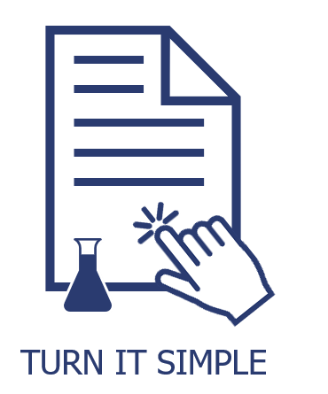
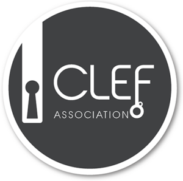

# SimpleText@CLEF-2021

[Accueil](https://simpletext-madics.github.io/2021/clef/fr) | [Appel à communication](https://simpletext-madics.github.io/2021/clef/fr/CFP) | [Dates importantes](https://simpletext-madics.github.io/2021/clef/fr/dates) | [Tâches pilotes](https://simpletext-madics.github.io/2021/clef/fr/tasks)  
[Programme](https://simpletext-madics.github.io/2021/clef/fr/program) | [Publications](https://simpletext-madics.github.io/2021/clef/fr/publications) | [Organisation](https://simpletext-madics.github.io/2021/clef/fr/organisation) | [Contacts](https://simpletext-madics.github.io/2021/clef/fr/contacts) | 

---

  

## SimpleText-2021 : (Re)raconter les bonnes histoires scientifiques aux non-spécialistes par la simplification des textes

*SimpleText est un nouvel atelier organisé dans le cadre de la [conference CLEF-2021](http://clef2021.clef-initiative.eu/), lancée par [l'initiative CLEF](http://www.clef-initiative.eu/).*

Les articles d’actualité jugés vrais par les fact-checkers (vérificateurs de faits) se propagent plus lentement et touchent moins de personnes que les fake news (fausses nouvelles). Les histoires que les individus jugent crédibles peuvent déterminer leur comportement, par exemple leur réaction à la pandémie, l'application d'une distanciation sociale, l'utilisation de faux traitements médicaux pouvant être dangereux, etc. Les fake news jouent sur les émotions des gens, mais pour les non-professionnels, elles sont aussi plus faciles à comprendre que les documents de recherche.

Les publications scientifiques peuvent être difficiles à lire pour les personnes extérieures au domaine. Par conséquent, elles ne sont pas lues même si elles sont accessibles. La vulgarisation scientifique est [l'un des plus anciens programmes de l'UNESCO](http://www.unesco.org/new/fr/natural-sciences/science-technology/sti-policy/global-focus/science-popularization/), mais la simplification des documents scientifiques est coûteuse et prend du temps. Les utilisateurs ne peuvent pas disposer d'un résumé instantané et simplifié sur un sujet spécifique qui les intéresse.

Pour commencer à résoudre ce problème, nous proposons un nouvel atelier appelé SimpleText qui vise à créer une communauté intéressée par la génération d'un résumé simplifié de documents scientifiques et à contribuer à rendre la science réellement ouverte et accessible à tous. L'objectif est de générer un résumé simplifié de plusieurs documents scientifiques à partir d'une requête donnée. La première année, nous prévoyons d'exécuter deux tâches pilotes :  

(1) À partir d’un texte scientifique, fournir des informations de base provenant d'une source externe pour aider l'utilisateur à le comprendre ;  

(2) À partir d'un texte scientifique court (par exemple un résumé), générer sa version simplifiée.  

Mots-clés :
* Simplification de textes scientifiques
*	Vulgarisation scientifique
*	Journalisme scientifique
*	Contextualisation
*	Connaissances de base

---

&nbsp;&nbsp;&nbsp;&nbsp;&nbsp;&nbsp;&nbsp;&nbsp;&nbsp;&nbsp;&nbsp;&nbsp;&nbsp;&nbsp;&nbsp;&nbsp;  &nbsp;&nbsp;&nbsp;&nbsp;&nbsp;&nbsp;&nbsp;&nbsp;&nbsp;&nbsp;&nbsp;&nbsp;&nbsp;&nbsp;&nbsp;&nbsp;&nbsp;&nbsp;&nbsp;&nbsp;&nbsp;&nbsp;&nbsp;&nbsp;  
